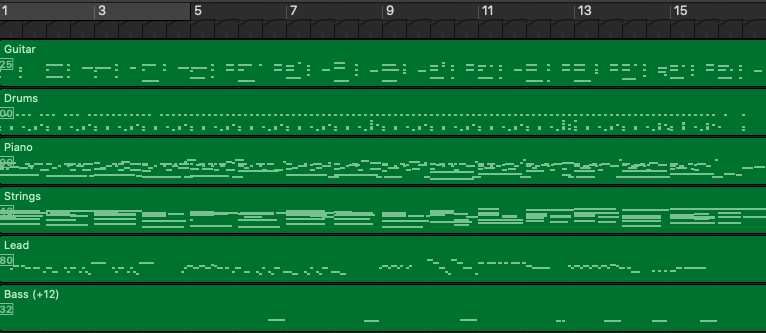
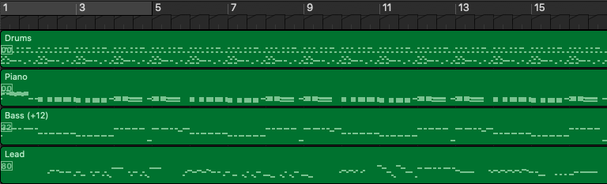
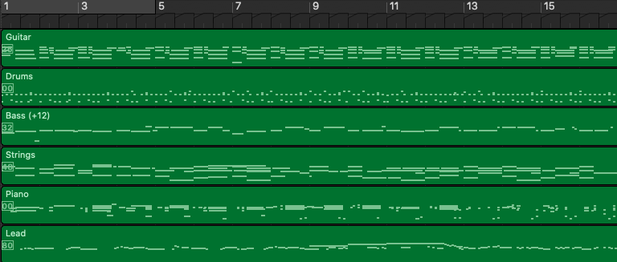
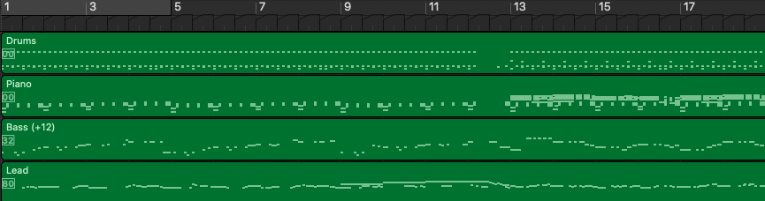
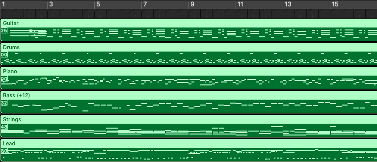
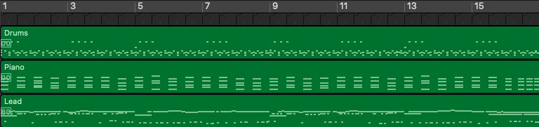

# PopMAG: Pop Music Accompaniment Generation

## Abstract

In pop music, accompaniments are usually played by multiple instruments (tracks) such as drum, bass, string and guitar, and can make a song more expressive and contagious by arranging together with its melody. Previous works usually generate multiple tracks separately and the music notes from different tracks not explicitly depend on each other, which hurts the harmony modeling. To improve harmony, in this paper, we propose a novel MUlti-track MIDI representation (MuMIDI), which enables simultaneous multi-track generation in a single sequence and explicitly models the dependency of the notes from different tracks. While this greatly improves harmony, unfortunately, it enlarges the sequence length and brings the new challenge of long-term music modeling. We further introduce two new techniques to address this challenge: 1) We model multiple note attributes (e.g., pitch, duration, velocity) of a musical note in one step instead of multiple steps, which can shorten the length of a MuMIDI sequence. 2) We introduce extra long-context as memory to capture long-term dependency in music. We call our system for pop music accompaniment generation as PopMAG. We evaluate PopMAG on multiple datasets (LMD, FreeMidi and CPMD, a private dataset of Chinese pop songs) with both subjective and objective metrics. The results demonstrate the effectiveness of PopMAG for multi-track harmony modeling and long-term context modeling. Specifically, PopMAG wins 42%/38%/40% votes when comparing with ground truth musical pieces on LMD, FreeMidi and CPMD datasets respectively and largely outperforms other state-of-the-art music accompaniment generation models and multi-track MIDI representations in terms of subjective and objective metrics.

We did not release the source codes since our model has been transferred to some products of the company.

  
## Authors

- Yi Ren* (Zhejiang University) rayeren@zju.edu.cn
- Xu Tan* (Microsoft Research Asia) xuta@microsoft.com
- Tao Qin (Microsoft Research Asia) taoqin@microsoft.com
- Jian Luan (Microsoft STCA) jianluan@microsoft.com
- Zhou Zhao (Zhejiang University) zhaozhou@zju.edu.cn
- Tie-Yan Liu (Microsoft Research Asia) tyliu@microsoft.com

## Audio Samples

<table><thead>
<tr>
<th style="text-align: center">/</th>
<th style="text-align: center">Melody (Input)</th>
<th style="text-align: center">PopMAG</th>
<th style="text-align: center">Ground-Truth</th>
</tr></thead><tbody>
<tr>
<td>Sample 1</td>
<td><audio controls="controls" ><source src="audio/4_lead.wav" autoplay/>Your browser does not support the audio element.</audio></td>
<td><audio controls="controls" ><source src="audio/4_pred.wav" autoplay/>Your browser does not support the audio element.</audio></td>
<td><audio controls="controls" ><source src="audio/4_gt.wav" autoplay/>Your browser does not support the audio element.</audio></td>
</tr>
<tr>
<td>Sample 2</td>
<td><audio controls="controls" ><source src="audio/2_lead.wav" autoplay/>Your browser does not support the audio element.</audio></td>
<td><audio controls="controls" ><source src="audio/2_pred.wav" autoplay/>Your browser does not support the audio element.</audio></td>
<td><audio controls="controls" ><source src="audio/2_gt.wav" autoplay/>Your browser does not support the audio element.</audio></td>
</tr>
<tr>
<td>Sample 3</td>
<td><audio controls="controls" ><source src="audio/3_lead.wav" autoplay/>Your browser does not support the audio element.</audio></td>
<td><audio controls="controls" ><source src="audio/3_pred.wav" autoplay/>Your browser does not support the audio element.</audio></td>
<td><audio controls="controls" ><source src="audio/3_gt.wav" autoplay/>Your browser does not support the audio element.</audio></td>
</tr>
<tr>
<td>Sample 4</td>
<td><audio controls="controls" ><source src="audio/1_lead.wav" autoplay/>Your browser does not support the audio element.</audio></td>
<td><audio controls="controls" ><source src="audio/1_pred.wav" autoplay/>Your browser does not support the audio element.</audio></td>
<td><audio controls="controls" ><source src="audio/1_gt.wav" autoplay/>Your browser does not support the audio element.</audio></td>
</tr>
</tbody>
</table>

## MIDI (Pianoroll)

<table><thead>
<tr>
<th style="text-align: center">/</th>
<th style="text-align: center">PopMAG</th>
<th style="text-align: center">Ground-Truth</th>
</tr></thead><tbody>
<tr>
<td>Sample 1</td>
<td>  </td>
<td>  </td>
</tr>
<td>Sample 2</td>
<td>  </td>
<td>  </td>
</tr>
<td>Sample 3</td>
<td>  </td>
<td>  </td>
</tr>
</tr>
<td>Sample 4</td>
<td>  </td>
<td>  </td>
</tr>
</tbody>
</table>
